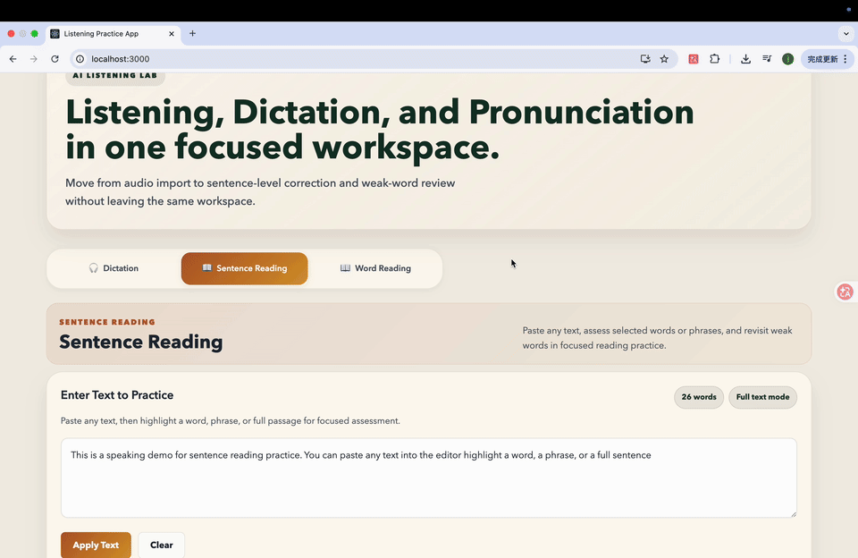
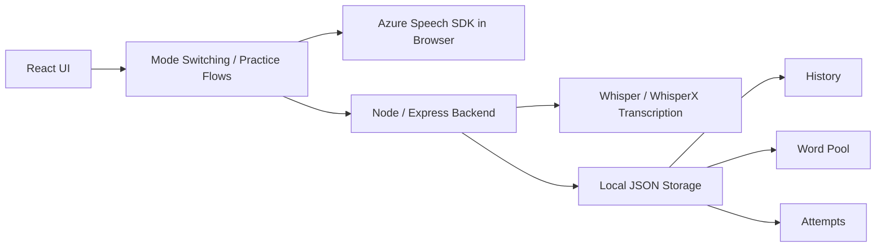

# React Listening Dictation & Pronunciation Corrector

An AI-assisted English listening and pronunciation training workspace built with React, Azure Speech SDK, and a lightweight Node.js and Python backend.

## Overview

This project combines three learning loops in a single interface:

- `Dictation Studio`: upload audio, replay sentence by sentence, type what you hear, and compare against the reference text
- `Sentence Reading`: paste arbitrary text, assess pronunciation for the full passage or a highlighted fragment
- `Word Review`: revisit problem words captured from different practice modes and focus on repeated weak spots

It is designed as a local-first demo project for showcasing:

- real-time browser speech assessment with Azure Speech SDK over websocket
- multi-mode language-learning UX in a single-page React app
- lightweight backend support for transcription, history persistence, and word storage

## Why This Project Stands Out

- It is not just a speech demo. It connects transcription, dictation feedback, pronunciation scoring, and review loops into one workflow.
- Pronunciation assessment runs in the browser with Azure Speech SDK, which keeps interaction latency low for repeated speaking practice.
- Listening history, problem words, and word review are tied together, so the app supports iterative learning instead of one-off API calls.
- The UI is intentionally product-shaped rather than tutorial-shaped: mode switching, history restore, focused practice panels, and review surfaces are all integrated.

## Core Product Modes

### 1. Dictation Studio

- Upload audio and transcribe it with `whisper-node` or `whisperx`
- Replay sentence audio quickly while typing your answer
- Unlock the original sentence only after answering
- Inspect diff feedback, pronunciation results, and per-session history


### 2. Sentence Reading

- Uses Azure Speech SDK in the frontend for low-latency websocket recognition
- Returns word-level and phoneme-level scoring
- Supports both full-sentence reading and focused single-word practice


### 3. Word Review

- Captures problematic words from dictation and sentence-reading separately
- Stores review history by date
- Lets users re-open historical weak-word sets for targeted repetition




## Architecture



### Runtime Responsibilities

- `Frontend`
  - dictation interaction
  - sentence reading interaction
  - low-latency pronunciation assessment with Azure Speech SDK
  - review and word-practice UI
- `Backend`
  - audio upload and transcription
  - local history persistence
  - centralized word storage
  - practice attempt logging

## Tech Stack

- `Frontend`: React 19, vanilla CSS, browser media APIs
- `Speech`: Azure Cognitive Services Speech SDK
- `Backend`: Node.js, Express, Python
- `Transcription`: whisper-node, optional whisperx
- `Audio tooling`: ffmpeg-static, fluent-ffmpeg
- `Persistence`: local JSON files under `back_node/db`

## Project Structure

```text
├── back_node/
│   ├── db/                  # local storage for words, history, attempts, uploads
│   ├── router_handler/      # transcription and persistence handlers
│   └── index.js             # backend entry
├── docs/
│   └── screenshots/         # README assets
├── src/
│   ├── components/          # feature UI components
│   ├── utils/               # shared hooks and network helpers
│   ├── App.js               # app shell and mode orchestration
│   └── App.css              # global product styling
└── public/
```

## Local Setup

### Prerequisites

- [Node.js](https://nodejs.org/) `v18+`
- an Azure Speech resource
- optional for `whisperx` mode: `python3`, a virtualenv, and the Python WhisperX service dependencies

### Environment Variables

Create root `.env` from `.env.example`:

```env
REACT_APP_API_BASE_URL=http://127.0.0.1:8888
REACT_APP_AZURE_SPEECH_KEY=your_azure_speech_key_here
REACT_APP_AZURE_SPEECH_REGION=your_azure_region_here
```

Create `back_node/.env` from `back_node/.env.example`:

```env
PORT=8888
WHISPERX_SERVICE_URL=http://127.0.0.1:8008
WHISPERX_MODEL=small
WHISPERX_DEVICE=cpu
WHISPERX_COMPUTE_TYPE=int8
```

### Install

```bash
npm install
cd back_node && npm install && cd ..
```

If you want to use `whisperx`, start the Python service separately:

```bash
cd back_node
python3 -m venv .venv
source .venv/bin/activate
pip install -r python_whisperx/requirements.txt
python3 python_whisperx/app.py
```

The Python WhisperX service sets `TORCH_FORCE_WEIGHTS_ONLY_LOAD=0` internally to stay compatible with newer PyTorch defaults.

### Run

```bash
npm run dev
```

- frontend: `http://localhost:3000`
- backend: `http://localhost:8888`
- whisperx service: `http://127.0.0.1:8008`

## Demo Notes

- This repository is optimized for local demonstration and portfolio review.
- Because pronunciation assessment uses the browser Azure SDK, frontend Azure env vars are required during local development.
- The backend is intentionally lightweight and stores data locally for easier demo setup.

## License

MIT. See [LICENSE](LICENSE).
